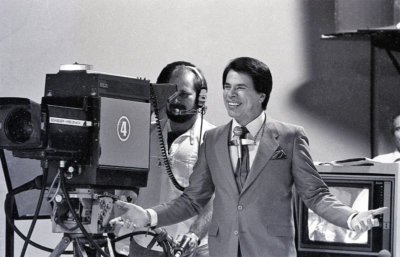

<!DOCTYPE html>
<html lang="PT-BR">

<head>
    <meta charset="UFT-8">
    <meta name="viewport" content="width=device-width, user-scalable=0">

    <link rel="stylesheet" type="text/css" href="assets/css/style.css">
    <link href="https://fonts.googleapis.com/css2?family=Caveat&family=Kalam:wght@300&display=swap" rel="stylesheet">

    <title>Silvio Santos</title>
</head>

<body>

    <header>
        

            

                <h1>Silvio Santos</h1>
            

            

                <h2>Apresentador, empresário e fundador do Sistema Brasileiro de televisão (SBT)</h2>
            

            

        

    </header>

    <section class="container_section">
        

            
        

        

            
 Silvio Santos é apresentador e empresário, fundador do SBT e proprietário do conglomerado Grupo Silvio
                Santos, que inclui as marcas Tele Sena e Jequiti. Começou a trabalhar como vendedor e foi para a TV em
                1960 apresentar seu 1º programa, o 'Vamos Brincar de Forca'. Em 1975, recebeu concessão para estrear a
                TVS, que mais tarde viraria o SBT, onde até hoje apresenta o 'Programa Silvio Santos'. Foi casado com
                Maria Aparecida Vieira, com quem teve a primogênita Cíntia e adotou Silvia. Ficou viúvo, no entanto, em
                1977, quando ela morreu de câncer. No ano seguinte, casou-se com Íris Abravanel, com quem teve Daniela,
                Patrícia, Rebeca e Renata.

        

        

            <h3>5 Curiosidades sobre Silvio Santos</h3>
            <ol>
                <li>
                    Senor Abravanel, esse é o verdadeiro nome de Silvio Santos, que nasceu em uma família humilde da Lapa, no Rio de Janeiro
                </li>
                <li>
                    Der acordo com o site americano da Forbes, o Grupo Silvio Santos fatura anualmente cerca de U$2 bilhões, sendo o SBT o seu carro-chefe.  
                </li>
                <li>
                    Em 1989, ele chegou a ser pré-candidato a presidência da República na primeira eleição direta do Brasil desde a ditadura militar em 1964. Sua candidatura foi impedida. Mesmo assim, ele conseguiu ser um dos líderes nas pesquisas. 
                </li>
                <li>
                    Outra curiosidade é que o apresentador já cantou marchinhas carnavalescas. Chegou a gravar cerca de 135 músicas em 4 discos. Algumas delas foram reprisadas no SBT, como “A pipa do vovô não sobe mais”. 
                </li>
                <li>
                    Em 2011, ele perdeu o direito de utilizar o jingle “Silvio Santos vem aí” por causa de um processo judicial. Em última instância, foi obrigado a indenizar o criador da canção.
                </li>
            </ol>

            

                Para mais informações visite o <a href="https://pt.wikipedia.org/wiki/Silvio_Santos">Wikipedia</a>.
            

        

    </section>

    <footer>
        

        

           <em>Desenvolvido por Márcio Oliveira</em> 
        

    </footer>

</body>

</html>
